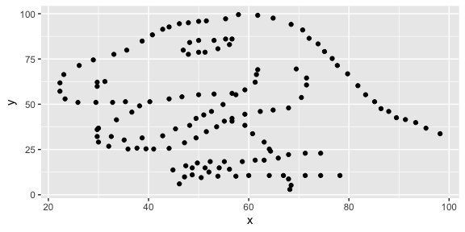
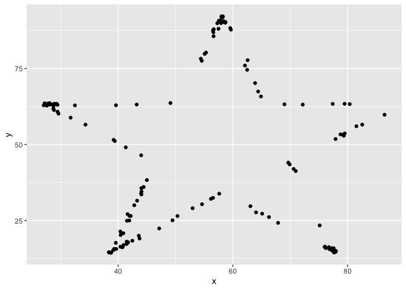
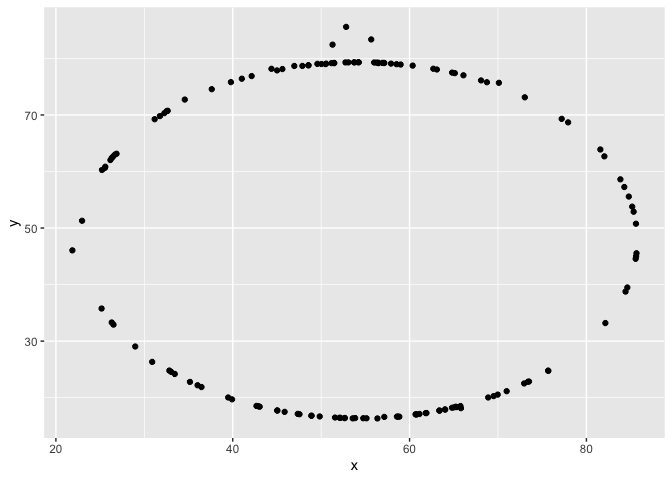

Lab 01 - Hello R
================
Lindsey Wilson
1/17/23

## Load packages and data

``` r
library(tidyverse) 
library(datasauRus)
```

## Exercises

### Exercise 1

According to the help file, the dataset has 1846 rows and 3 variables
(“dataset”, “x”, and “y”)

    ?datasaurus_dozen

### Exercise 2

The correlation between “x” and “y” in the dino_data dataset is -0.0645.

And here’s what the data look like plotted:

``` r
dino_data <- datasaurus_dozen %>%
  filter(dataset == "dino")

ggplot(data = dino_data, mapping = aes(x = x, y = y)) +
  geom_point()
```

<!-- -->

And here’s the code I used (was given) to find the correlation!

``` r
dino_data %>%
  summarize(r = cor(x, y))
```

    ## # A tibble: 1 × 1
    ##         r
    ##     <dbl>
    ## 1 -0.0645

### Exercise 3

Below we have the code that allows us to plot the star data

First, we create a dataset with just the star data

Then, we plot that data using the same code we used for the dino data

``` r
star_data <- datasaurus_dozen %>%
  filter(dataset == "star")

ggplot(star_data, aes(x = x, y = y)) + 
  geom_point()
```

<!-- -->

The same code from Ex. 2 also lets us find the correlation between “x”
and “y”

``` r
star_data %>%
  summarize(r = cor(x, y))
```

    ## # A tibble: 1 × 1
    ##         r
    ##     <dbl>
    ## 1 -0.0630

So we can see that the correlation comes out to -0.0630

### Exercise 4

Following the example of the last few sections, we can find the
correlation between “x” and “y” in the circle data

``` r
circle_data <- datasaurus_dozen %>%
  filter(dataset == "circle")

circle_data %>%
  summarize(r = cor(x, y))
```

    ## # A tibble: 1 × 1
    ##         r
    ##     <dbl>
    ## 1 -0.0683

And plot it

``` r
ggplot(circle_data, aes(x = x, y = y)) +
  geom_point()
```

<!-- -->

### Exercise 5

Add code and narrative as needed.

To add R chunks either type out the backticks, curly braces, and the
letter `r` or use the Insert chunk button above, green C+.
